# Bose Frames Teardown

- [Bose Frames Teardown](#bose-frames-teardown)
  - [What are Bose Frames?](#what-are-bose-frames)
  - [The teardown](#the-teardown)
    - [Left arm](#left-arm)
    - [Centre](#centre)
    - [Right arm](#right-arm)
  - [So what next?](#so-what-next)
    - [Situation](#situation)
    - [Functionality wishlist](#functionality-wishlist)
    - [Ideas](#ideas)

## What are Bose Frames?
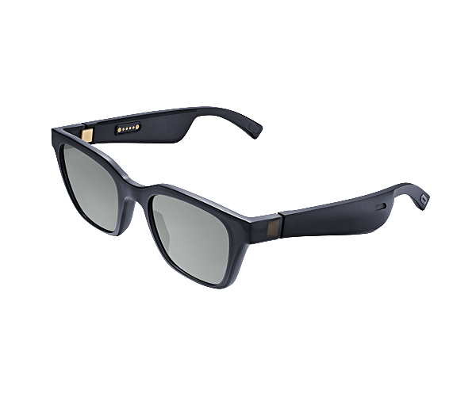

Imagine you took a pair of bluetooth earphones and a pair of glasses then smushed them together. The end result would be the Bose Frames. They're a slightly oversized but otherwise normal looking pair of sunglasses made of nylon but in each arm is a speaker and a bit of electronics. The speakers fire downwards towards your ears without blocking them so you can still hear your surroundings which is extremely useful while cycling or jogging. The sound quality is pretty good, comparable to a pair of wired earbuds that rest in your ear rather than wedging in your ear canal. It's a little lacking in bass but mid and high ranges are good and you could happily listen to music via them. You couldn't listen for very long though as the battery life on the first generation is about 3 hours of playback and they can't be used while charging. 

I bought a pair of Altos back in January 2020 and had them fitted with prescription lenses by a local optician (Seen Optician in Manchester UK, excellent service). I used them as my daily wear glasses until a few months back they stopped working, the ribbon cable connecting the left and right sides had snapped, and while they were under warranty COVID had kicked off and I didn't feel like sending my glasses off for who knows how long. Today I got a bit bored and decided to crack them open to see if I could repair them myself.

## The teardown

### Left arm
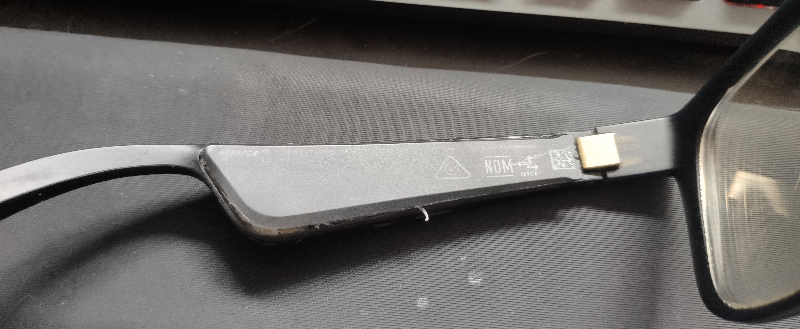
The left arm has two nylon parts, a moulded shell and a plate that glues to the shell. If you are wearing the glasses the plate is closest to your head. The hinge end is partially open so I recommend prying there gently. Be careful not to pry too deeply as there's a lithium ion battery inside. There are no clips holding the plate in. While nylon is flexible the glue is strong enough to bend or snap the plate so cut the glue as you go.

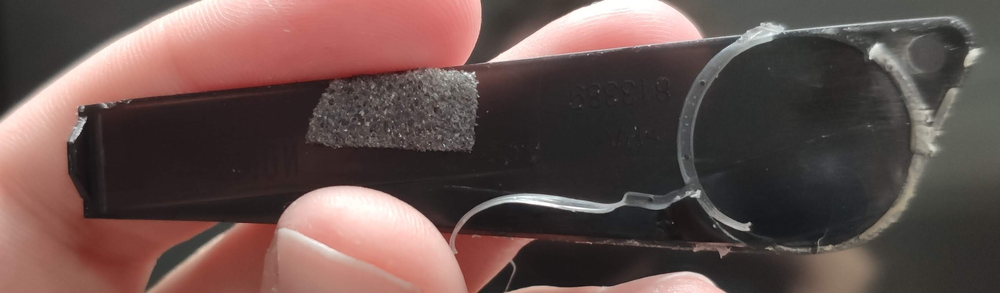
On the inside of the plate there's the remnants of some glue that helps to form an acoustic chamber for the speaker, along with some foam to hold the battery in place.

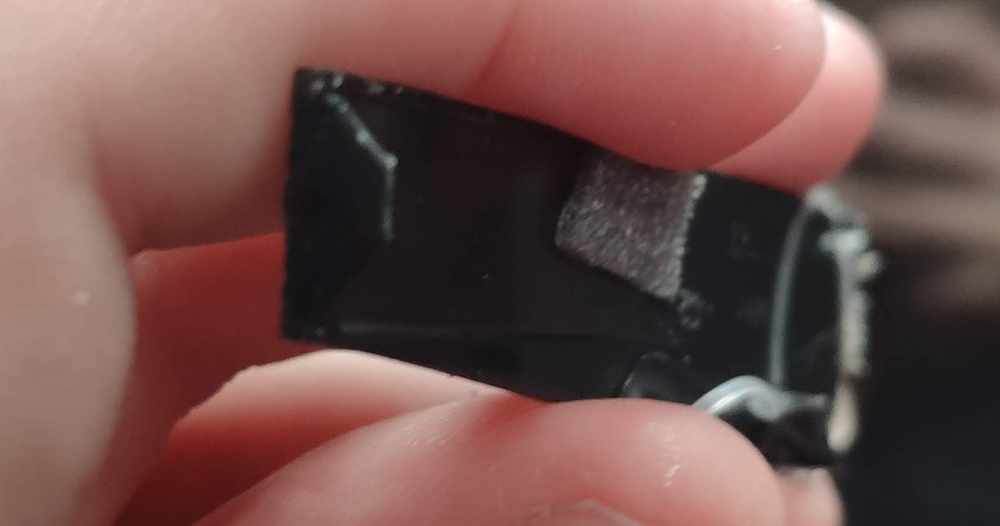
This bit of the plate attempts to stop dust and pry-tool ingress. I think the Bose Frames have a water resistance rating but it's likely low. I feel bad for taking mine in the shower.

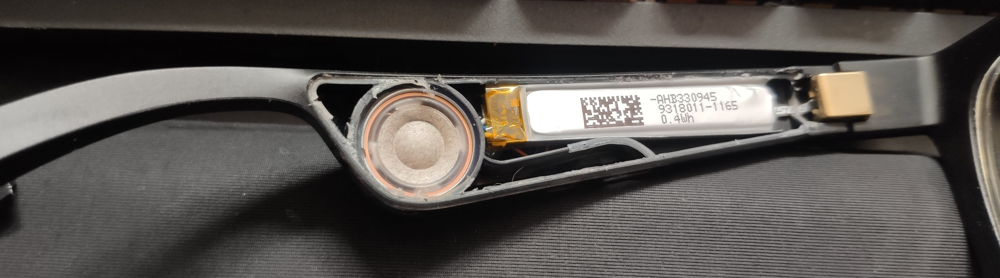
The left arm contains a 0.4Wh lithium ion pouch battery, a speaker, and some mouldings that combine with glue to make a sealed acoustic chamber. I'm sure Bose put a lot of time and effort into those mouldings.

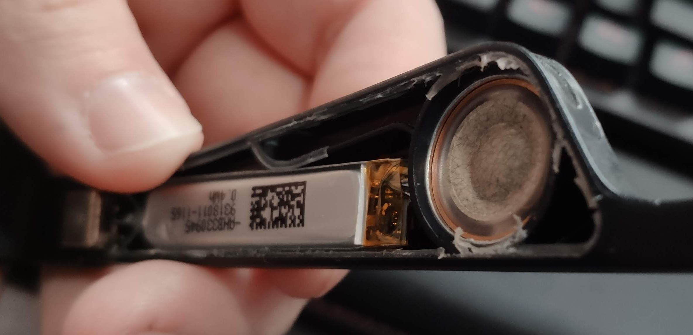

It's a little hard to see but there's three sections to the acoustic chamber. I think the long section connects to the space in front of the speaker while the small triangular section connects to the back of the speeaker. That would fit with three ear-facing speaker grilles on the bottom of the arm and one outward-facing grille roughly where that triangular section is.

### Centre
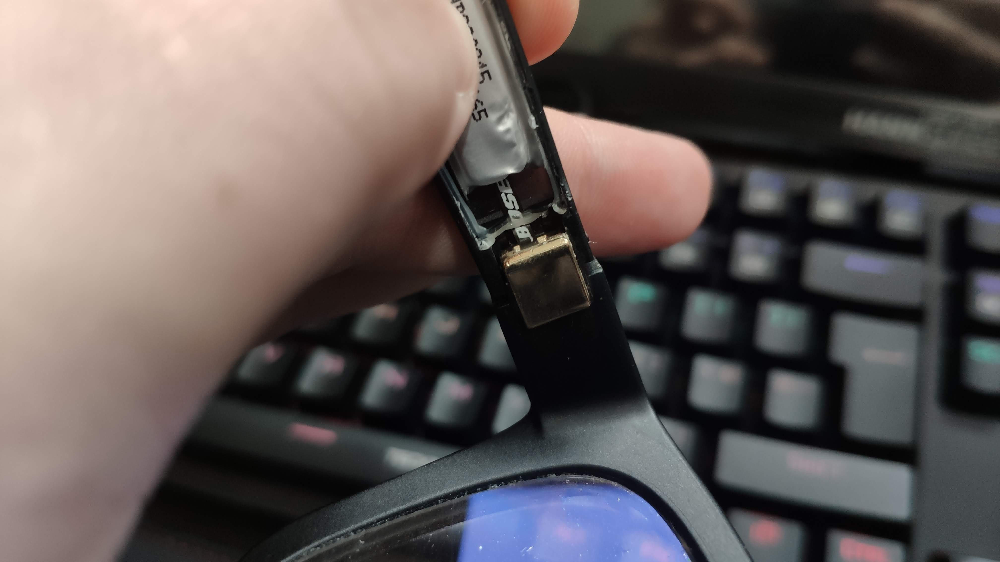
You can see a ribbon cable here labelled Bose, that cable carries power from the left to the right arm as well as audio from the right to the left. It runs through the hinges on each side and flexes whenever you close the glasses. The nylon of the Frames is slightly translucent so let's trace that ribbon cable over to the right side.

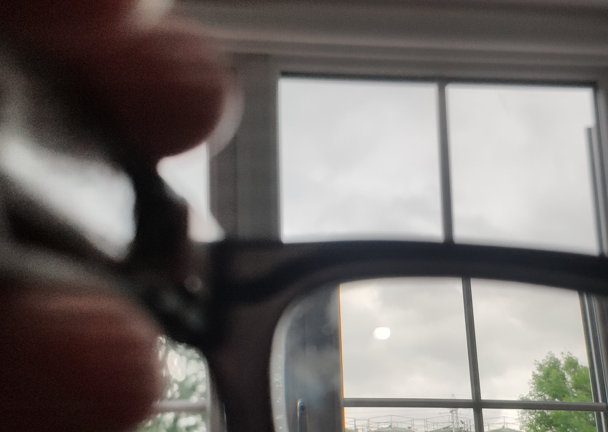
The ribbon cable runs along the top of the front of the Frames. It is moulded into the plastic and I don't see an obvious way to remove it but the entire front should be cheap to replace.

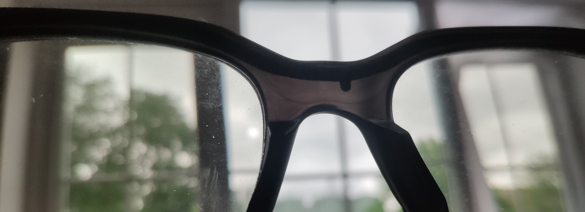
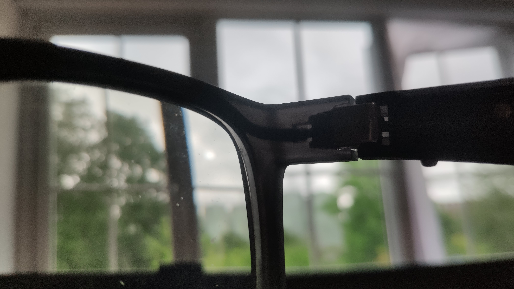
You can see how the hinge mates with the front here, it's sort of barbed. I think that means the hinges aren't replaceable without replacing the front plastic too.

### Right arm
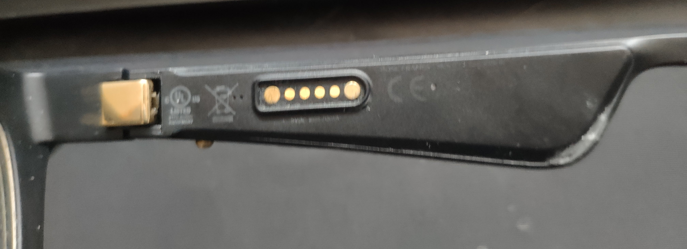
Let's start taking the right side apart. This side contains the main circuit board as you can see from the button, charging point and the microphone holes to the left of the charging point.

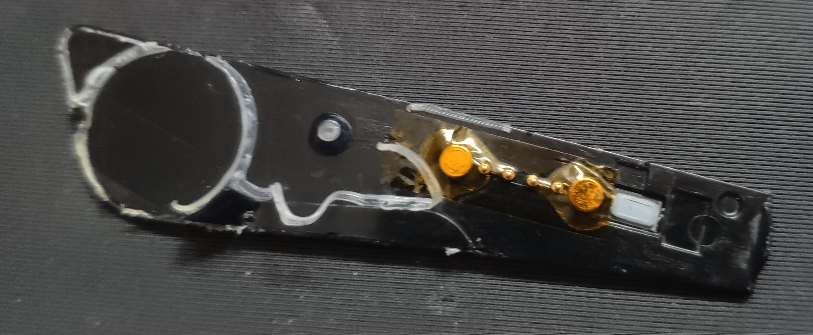
You can pry from the front just like the left side but there are more parts in this cover so be a bit more careful. The hole on the left I think is for pressure equalisation. The charging point is made of two magnets and four pogo pins for the four pins of USB 2.0. On the right is a diaphram covering the microphone inputs, possibly a dust cover? There are no cables connecting this cover to the board thankfully. The area around the pins is covered in kapton cape to avoid shorts.

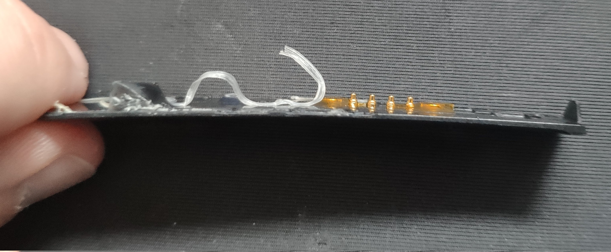
Yup, springy pogo pins, also called push pins.

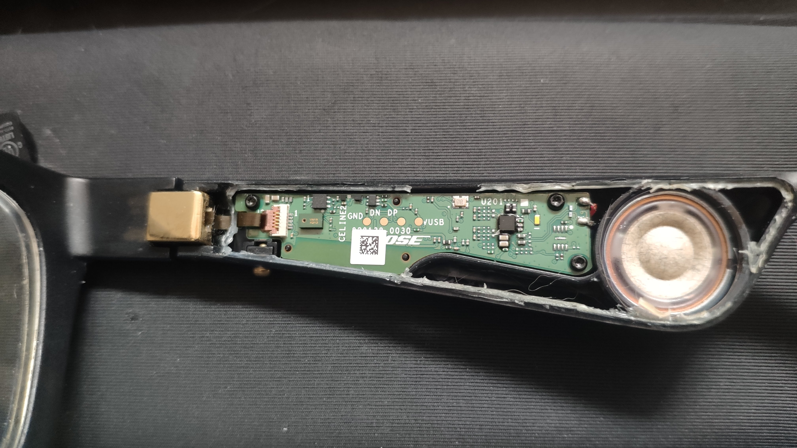
There's a lot more going on inside the right arm. The acoustic chamber and speaker assembly looks the same. The circuit board is nicely shaped to fit the remaining space and I like that it's held in with a few plastic location pins and three tiny torx screws. I imagine the second generation replaces those screws with glue. There are four pads on the board to receive the pogo pins used for charging. The data pins go through to the board but the Bose Frames can't be used while charging and don't appear as a USB DAC or anything, perhaps there's a way to flash new firmware over USB if the normal bluetooth update path fails. On the left there's a raised green chip which I think is the microphone. Further left there's a connector for the ribbon cable, good to know it's removable. You can see five pins on that connector which would cover audio, power and maybe battery status. 

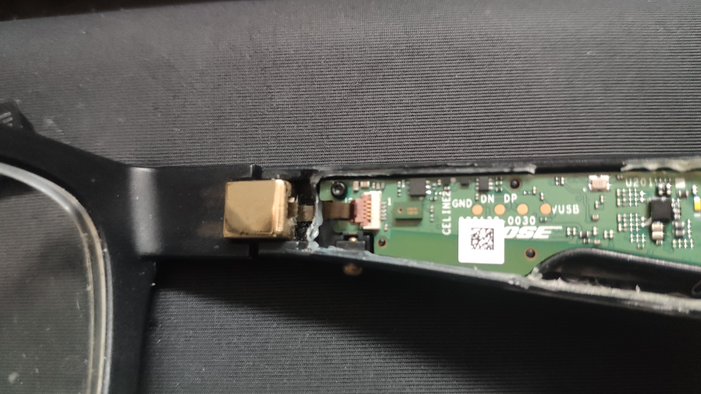
Womp womp. That ribbon cable isn't meant to be torn. It's broken quite close to the hinge so I would struggle to scrape off the insulation and solder on new cables. As for why it snapped maybe the arm opened a little too far, maybe it was opened and closed too many times, or maybe it was glued down with too little slack on the left. 

## So what next?
### Situation
That ribbon cable has snapped at a really awkward point. I don't think I can solder onto it to get the Frames working again and even if I could I'm not sure the fix would last very long. These arms get folded in every night so the ribbon cable sees a lot of wear and tear. My warranty is super void by now so no relying on Bose to fix them. They also have some quite expensive photochromic lenses fitted so I don't want to replace them yet. 

### Functionality wishlist
- USB audio device to hook up to a PC
- Bluetooth
- 3.5mm for situations where bluetooth doesn't work
- Play music while charging
- Microphone

### Ideas

I've got three options that I can see:
- Try and fix the Frames back to original specification
- Completely replace the electronics
- Completely remove the electronics

I think replacing the ribbon cable would need me to purchase a whole new front section and swap my lenses over. That's probably the safest option but I don't know if the parts are available or how to safely swap my lenses, they're not made to be removed unlike the stock ones. Swapping the electronics would be fun and probably give me increased battery life because bluetooth devices have come on a way since the Frames were new but it's also the most complex. 

I think I'm going to remove the electronics entirely leaving the speakers and their chambers intact. If I expose those speakers on a 3.5mm jack that would give me loads of flexibility, I could connect to my PC or use a bluetooth receiver. The units would likely get a bit uglier but I can live with that. Remaining questions are things like... 
- What's the resistance of the speakers?
- Did Bose use an equaliser to make them sound good?
- What's the best connector to use?
- How to route cables?
- Could I fit a microphone too?

The arms are roughly 4-5mm deep and 12mm tall, this will limit the connectors I can use. A 2.5mm jack would technically fit but the socket wouldn't. Thankfully there are some tiny coax connectors out there with amazing specs, I see MMCX recommended for its higher insertion cycle rating but minimum height of 6mm when mated so some 3D modelling required. 